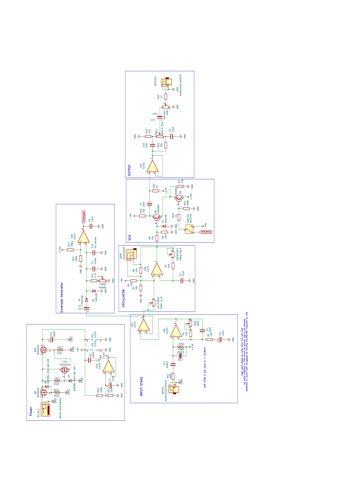

# Osczillator-turned-Fuzz-Fuzzilator-
A fuzz circuit utilizing a Schmitt-trigger-based oscillator, capable of producing drone sounds and (quasi) amplitude-modulated tones.
## Overview
At the core of this circuit lies a Schmitt-trigger oscillator that generates a steady-frequency drone, controllable via an external expression pedal.  
The envelope of the guitar signal is extracted and used to mute the drone when no input signal is present. When the input signal is injected into the Schmitt trigger, it becomes fuzzy and interacts with the signal generated by the oscillator

## Features

### Controlls
 - **Gain** – A trimmer on the PCB sets the overall gain. Adjusting it has only a subtle effect but can help if the output signal cuts off too abruptly.  
 - **Git/Synth** – Determines how much of the input signal is fed into the oscillator. Turning it to the left creates synth-like, modulated tones. Turning it right yields a more traditional fuzz character.
 - **Frequency** This controlls the frequency of the oscillator. It goes from deep bass sounds to sqeeling noises. With the Git/Synth knob turned more towards the guitar side, it controlls the sonic characterstic of the fuzz.
 - **VCA Switch** Engages or bypasses the voltage-controlled amplifier (VCA). When bypassed, the synth drone continues even without input signal. When engaged, its behavior depends on the Gate knob setting.
 - **Gate** Adjusts the sensitivity of the VCA to the input signal. Depending on the setting the oscillator may still sound, even with the VCA engaged.  
 - **Tone** this knob controls a Big Muff-style tone circuit.

### Expression Input
Optionally an expression pedal can be used to controll the frequency of the oscillator. This allows for nice interactions between the drone and guitar.

## Design Notes
For the power supply I used my standard overvoltage and reverse protection circuit. There is an additional buffer before the oscillator circuit which at first glance might seem unneccessary, however I noticed that with the high gain from the first gain stage the TL072 struggles when loaded further by the oscillator. The envelope follower is based on the mxr blue box with some changes to accomodate for my vca design. The vca is a rather crude circuit, but I believe it works quite nicely for this application. Essentially its half of a long tailed pair with a current sink. 

## Schematic

